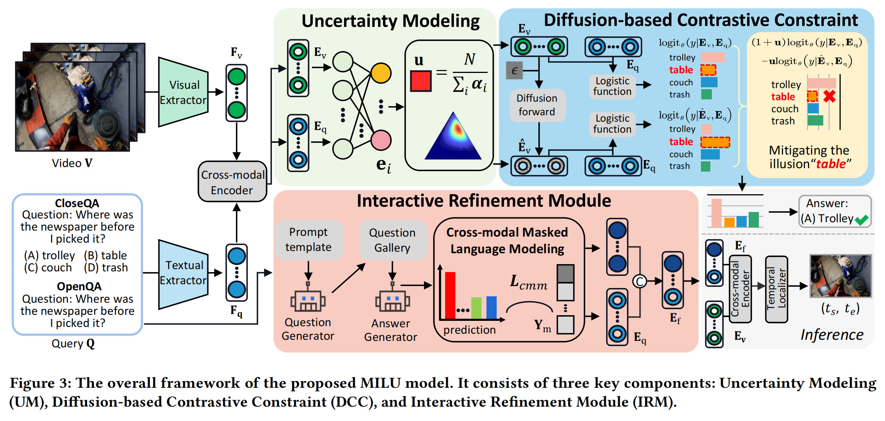
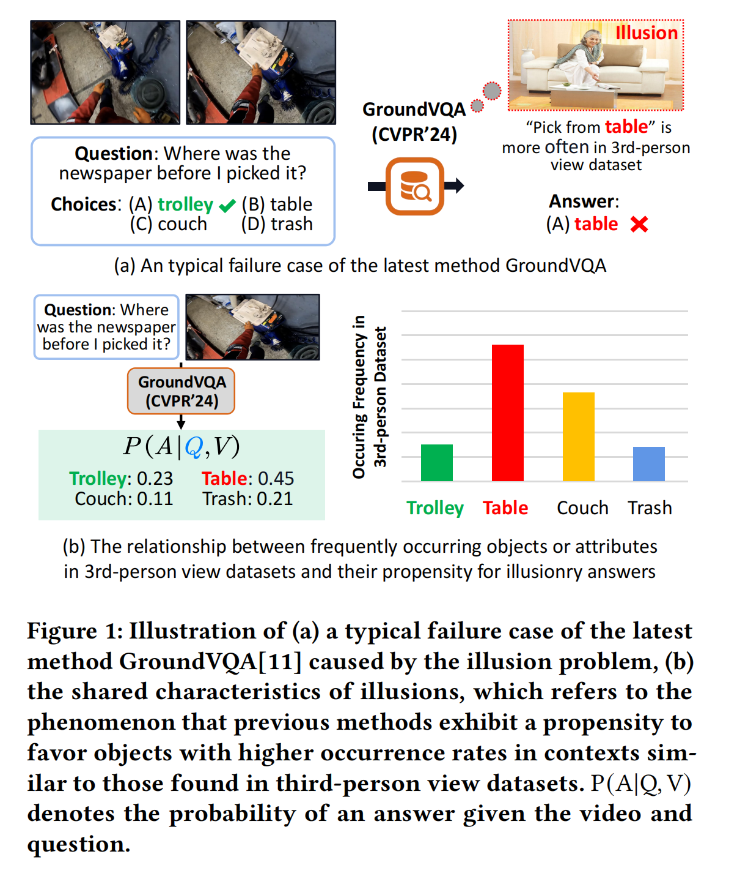
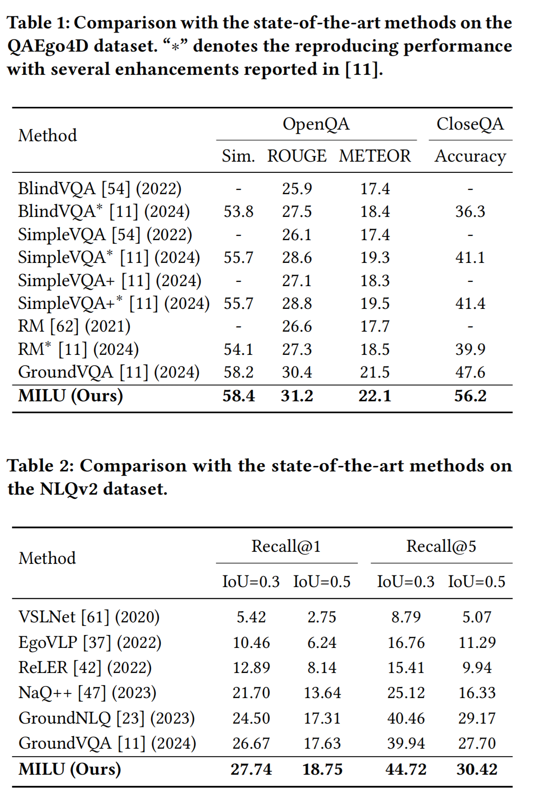
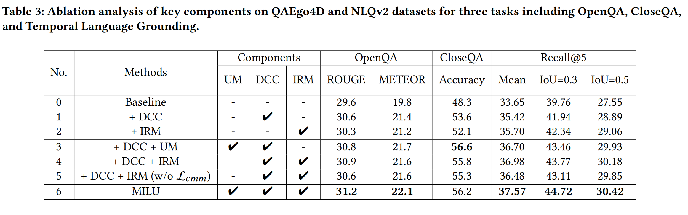
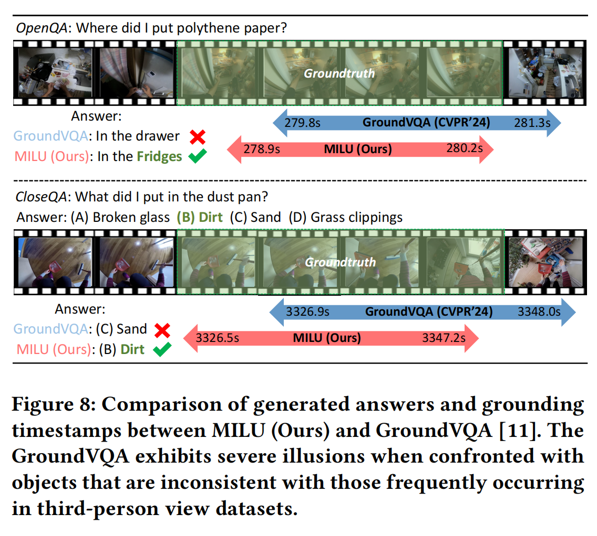

## Introduction
This is the source code of "Mitigating Illusions for Grounded Question Answering in Egocentric Videos". 

## Mitigating Illusions for Grounded Question Answering in Egocentric Videos
The MILU model is structured with three integral components:

1) **Uncertainty Modeling (UM):** This component employs the Subjective Logic theory to model the unreliability degree of generated responses, which enables the model to assess the extent of penalty for improper answers.

2) **Diffusion-based Contrastive Constraint (DCC):** Designed to assign reasonable restraint to mitigate the illusion according to the uncertainty. 

3) **Interactive Refinement Module (IRM):** Focused on utilizing the large language model to progressively supplement additional fine-grained information, thus improving the understanding of visual and textual semantics.




## Proposed Model (MILU)
* Uncertainty Modeling (UM)
* Diffusion-based Contrastive Constraint (DCC)
* Interactive Refinement Module (IRM)


## Motivation

Due to the ignorance of the statistical bias, existing methods that predominantly adopted the models pre-trained on the third-person view datasets tend to choose frequently occurring objects and attributes from such datasets, resulting in an illusion issue.
The figure 1 consistently shows an illusion issue: the over-confident bias towards prevalent identities existing in the similar context of third-person view dataset, such as the action pick the newspaper more frequently happen when the newspaper on a table rather than textit on a trolley.

## Results


## Ablation Study on QAEgo4D and NLQv2


## Grounding and QA Examples



## Usage
* Training
```python
CUDA_VISIBLE_DEVICES=0,1,2,3 python run.py \
    model=MILU \
    'dataset.qa_train_splits=[QaEgo4D_train]' \
    dataset.batch_size=4 \
    trainer.gpus=4
```
* Testing
```python
CUDA_VISIBLE_DEVICES=0 HYDRA_FULL_ERROR=1 python run.py \
    model=MILU \
    'dataset.qa_train_splits=[QaEgo4D_train]' \
    'dataset.test_splits=[QaEgo4D_test]' \
    dataset.batch_size=8 \
    +trainer.test_only=True \
    '+trainer.checkpoint_path="./"'
```

